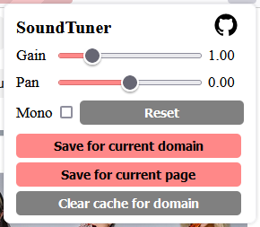
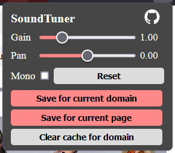

# SoundTuner

Extension to manipulate background sounds. Can lower/increase volume, add pan and mono. Can also save background sounds per website for future visits.

## Screenshots

## Prerequisites

-   [npm](https://www.npmjs.com)
-   [web-ext](https://github.com/mozilla/web-ext)

## Building

**Clone the Repository**

    git clone https://github.com/LoneCoder21/SoundTuner.git

**Install [web-ext](https://github.com/mozilla/web-ext)**

    npm install --global web-ext

**Build [web-ext](https://github.com/mozilla/web-ext)**

    web-ext build

## Running

**Run [web-ext](https://github.com/mozilla/web-ext)**

    web-ext run

## FAQ

Web-ext provides the backbone behind this project. Consult this [link](https://extensionworkshop.com/documentation/develop/getting-started-with-web-ext/) to learn more about web-ext.

If you'd like to learn more about extensions, then go to this [link](https://developer.mozilla.org/en-US/docs/Mozilla/Add-ons/WebExtensions).

## Contributing

We welcome contributions from the community! If you'd like to contribute to this project, please read our [Contribution Guidelines](CONTRIBUTING.md) for details on how to get started.

## License

This project is open-source and available under the [MIT License](LICENSE).
